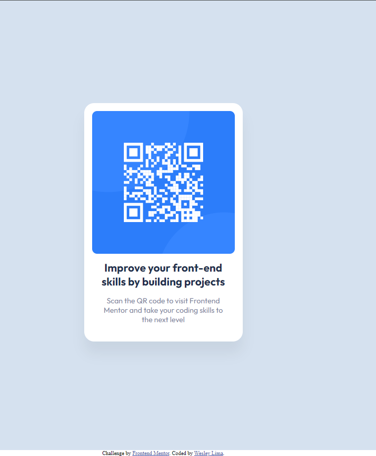

# Frontend Mentor - QR code component solution

This is a solution to the [QR code component challenge on Frontend Mentor](https://www.frontendmentor.io/challenges/qr-code-component-iux_sIO_H). Frontend Mentor challenges help you improve your coding skills by building realistic projects. 

## Table of contents

- [Overview](#overview)
  - [Screenshot](#screenshot)
  - [Links](#links)
- [My process](#my-process)
  - [Built with](#built-with)
  - [What I learned](#what-i-learned)
  - [Continued development](#continued-development)
  - [Useful resources](#useful-resources)
- [Author](#author)


## Overview

### Screenshot




### Links

- Solution URL: [Add solution URL here](https://github.com/webwesley/qr-code-component)

## My process

### Built with

- HTML5
- CSS3
- Flexbox
- Mobile-first workflow

### What I learned

I develop the project with just HTML and CSS, so for me was a safe and easy way trough to follow.
I have learned more skills for search in forums, like Stack Overflow, and dig the internet for answers.
For code, a good trick i've learn is use Self-Hosting fonts and and referencing them with CSS @font-face rules

```css
@font-face {
    font-family: "Outfit Regular";
    src: url("../fonts/Outfit-Regular.ttf");
}
```

### Continued development

I'm still not completely comfortable with Bootstrap and Sass, so i use just pure CSS. So my goal is learn more about CSS frameworks for more efficient work.

### Useful resources

- [Dev Media](https://www.devmedia.com.br/css-font-face/36828) - This helped me for CSS @font-face. I really liked this and will use it going forward.

## Author

- Frontend Mentor - [@webwesley](https://www.frontendmentor.io/profile/webwesley)
- Github - [@webwesley](https://github.com/webwesley)